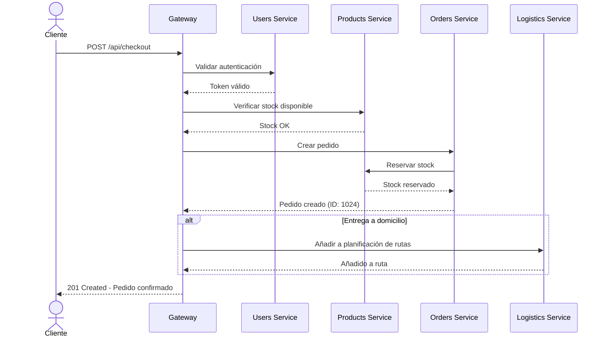

# Sistema de Gestión Azulejos Romu - Arquitectura de Microservicios

## Actividad 02 - Desarrollo de un sistema software basado en microservicios

**Alumno**: Manahen  
**Proyecto Base**: Sistema de Gestión de Azulejos Romu  
**Fecha**: Noviembre 2025

---

## 1. Introducción del Sistema a Desarrollar

### 1.1 Contexto Empresarial

**Azulejos Romu** es una empresa establecida en Plasencia (Cáceres) dedicada a la comercialización de azulejos y muebles de baño. Actualmente opera con:

- **1 tienda física** en Plasencia
- **2 almacenes** de distribución
- **Flota de camiones** para reparto local
- **Gestión tradicional** mediante hojas de cálculo Excel

### 1.2 Problemática Actual

La empresa enfrenta desafíos significativos debido a su sistema de gestión obsoleto:

- ✗ Control de stock descentralizado y propenso a errores
- ✗ Dificultad para rastrear pedidos en tiempo real
- ✗ Rutas de entrega no optimizadas
- ✗ Falta de visibilidad sobre ubicación de repartidores
- ✗ Procesos manuales que generan retrasos e inconsistencias

### 1.3 Solución Propuesta

Desarrollo de un **sistema integrado basado en microservicios** que digitalice y automatice todos los procesos de negocio de Azulejos Romu.

### 1.4 Objetivos del Sistema

1. **Gestión de Stock Inteligente**
   - Control en tiempo real de inventario en almacenes y tienda
   - Alertas automáticas de reposición
   - Trazabilidad completa de movimientos

2. **Gestión Integral de Pedidos**
   - Pedidos de clientes (domicilio y recogida en tienda)
   - Pedidos de reposición tienda → almacén
   - Pedidos a proveedores externos
   - Seguimiento de estados en tiempo real

3. **Logística Optimizada**
   - Cálculo automático de rutas óptimas
   - Tracking GPS en tiempo real de camiones
   - Asignación inteligente de entregas

4. **Seguridad y Control de Acceso**
   - Autenticación robusta con JWT
   - Control de acceso basado en roles
   - Auditoría completa de operaciones

---

## 2. Descripción de Casos de Uso y División en Microservicios

### 2.1 Actores del Sistema

| Actor | Rol | Responsabilidades |
|-------|-----|-------------------|
| **Administrador** | Gestión total del sistema | Configuración, reportes, supervisión general |
| **Cliente** | Consumidor final | Realizar y consultar pedidos |
| **Dependiente de Tienda** | Atención al cliente | Gestión de stock tienda, pedidos a almacén |
| **Mozo de Almacén** | Gestión de almacén | Control de stock, preparación de pedidos |
| **Gestor de Cuentas** | Contabilidad | Consulta de históricos y reportes financieros |
| **Repartidor** | Conductor | Visualización de rutas y actualización de entregas |

### 2.2 Identificación de Business Capabilities

Aplicando la técnica de **Domain-Driven Design (DDD)**, se han identificado las siguientes capacidades de negocio fundamentales:

#### **BC-1: Gestión de Productos y Stock** 
**Responsabilidad**: Mantener el catálogo de productos y controlar el inventario

**Casos de Uso**:
- **CU-01**: Mantener Catálogo de Productos
- **CU-02**: Gestionar Información de Proveedores
- **CU-03**: Consultar Stock Disponible
- **CU-04**: Controlar Movimientos de Stock
- **CU-05**: Generar Alertas de Reposición

#### **BC-2: Gestión de Pedidos**
**Responsabilidad**: Procesar y hacer seguimiento de todos los tipos de pedidos

**Casos de Uso**:
- **CU-06**: Realizar Pedido de Cliente
- **CU-07**: Gestionar Pedido de Reposición (Tienda → Almacén)
- **CU-08**: Gestionar Pedido a Proveedor Externo
- **CU-09**: Actualizar Estado de Pedido
- **CU-10**: Consultar Historial de Pedidos
- **CU-11**: Gestionar Reservas de Stock

#### **BC-3**: Logística y Distribución**
**Responsabilidad**: Optimizar entregas y tracking de flota

**Casos de Uso**:
- **CU-12**: Gestionar Flota de Camiones
- **CU-13**: Optimizar Rutas de Entrega
- **CU-14**: Realizar Seguimiento GPS en Tiempo Real
- **CU-15**: Asignar Entregas a Repartidores
- **CU-16**: Actualizar Estado de Entregas

#### **BC-4: Gestión de Usuarios y Seguridad**
**Responsabilidad**: Autenticación, autorización y gestión de accesos

**Casos de Uso**:
- **CU-17**: Autenticar Usuario
- **CU-18**: Gestionar Roles y Permisos
- **CU-19**: Asignar Mozos a Almacenes
- **CU-20**: Auditar Operaciones del Sistema

### 2.3 Microservicios Identificados

Con base en las capacidades de negocio, se definen los siguientes **4 microservicios base**:

```
┌─────────────────────────────────────────────────────────┐
│          MICROSERVICIOS AZULEJOS ROMU                   │
├─────────────────────────────────────────────────────────┤
│                                                         │
│  1. products-service                                    │
│     └─ Productos, Proveedores, Stock                   │
│                                                         │
│  2. orders-service                                      │
│     └─ Pedidos (Cliente, Reposición, Proveedor)        │
│                                                         │
│  3. logistics-service                                   │
│     └─ Flota, Rutas, Tracking GPS                      │
│                                                         │
│  4. users-service                                       │
│     └─ Autenticación, Usuarios, Roles                  │
│                                                         │
│  5. gateway-service (SERVICIO CENTRAL)                 │
│     └─ Orquestación y API Gateway                      │
│                                                         │
└─────────────────────────────────────────────────────────┘

          SERVICIOS DE INFRAESTRUCTURA
┌─────────────────────────────────────────────────────────┐
│  • eureka-server (Puerto 8761)                          │
│    Registro y descubrimiento de servicios               │
│                                                         │
│  • config-server (Puerto 8888)                          │
│    Configuración centralizada                           │
└─────────────────────────────────────────────────────────┘
```

### 2.4 Casos de Uso Detallados

#### CU-01: Mantener Catálogo de Productos

**Actor Principal**: Administrador  
**Microservicio**: products-service  
**Precondiciones**: Usuario autenticado como Administrador

**Flujo Principal**:
1. Administrador selecciona opción "Gestionar Productos"
2. Sistema muestra lista de productos existentes
3. Administrador puede:
   - Crear nuevo producto (código, nombre, descripción, precio, categoría, proveedor, dimensiones)
   - Modificar producto existente
   - Eliminar producto (desactivación lógica)
   - Consultar detalles completos
4. Sistema valida datos ingresados
5. Sistema actualiza base de datos
6. Sistema confirma operación exitosa

**Postcondiciones**: Catálogo actualizado

---

#### CU-03: Consultar Stock Disponible

**Actor Principal**: Dependiente de Tienda, Mozo de Almacén  
**Microservicio**: products-service

**Flujo Principal**:
1. Usuario busca producto por código o nombre
2. Sistema muestra:
   - Stock en tienda
   - Stock en Almacén Central
   - Stock en Almacén Norte
   - Stock reservado en cada ubicación
   - Stock disponible real
3. Sistema indica si requiere reposición (stock < umbral mínimo)

**Variantes**:
- Si usuario es Dependiente: solo ve stock de su tienda y almacenes
- Si usuario es Mozo: ve stock del almacén asignado

---

#### CU-06: Realizar Pedido de Cliente

**Actor Principal**: Cliente, Dependiente de Tienda  
**Microservicio**: orders-service, products-service, logistics-service

**Flujo Principal**:
1. Cliente selecciona productos del catálogo
2. Cliente indica cantidades deseadas
3. Cliente elige método de entrega:
   - Opción A: Entrega a domicilio
   - Opción B: Recogida en tienda
4. Sistema verifica stock disponible (products-service)
5. Sistema crea pedido en estado "PENDIENTE"
6. Sistema reserva stock (products-service)
7. Si es entrega a domicilio:
   - Sistema notifica a logistics-service
   - Sistema planifica inclusión en ruta
8. Sistema genera número de pedido
9. Sistema envía confirmación al cliente

**Postcondiciones**: 
- Pedido creado
- Stock reservado
- Ruta planificada (si aplica)

---

#### CU-13: Optimizar Rutas de Entrega

**Actor Principal**: Sistema (automático), Administrador  
**Microservicio**: logistics-service, orders-service

**Flujo Principal**:
1. Sistema obtiene lista de pedidos pendientes de entrega
2. Sistema extrae direcciones de destino
3. Sistema calcula ruta óptima usando algoritmo "Nearest Neighbor"
   - Minimiza distancia total
   - Respeta capacidad del camión
   - Considera ventanas horarias
4. Sistema asigna ruta a camión disponible
5. Sistema asigna repartidor
6. Sistema genera secuencia de paradas
7. Sistema calcula tiempos estimados de llegada
8. Repartidor recibe notificación con ruta optimizada

**Algoritmo de Optimización**:
```
Algoritmo Nearest Neighbor (Vecino Más Cercano):
1. Punto inicial = Almacén
2. Mientras haya destinos sin visitar:
   a. Calcular distancia a todos los destinos pendientes
   b. Seleccionar el destino más cercano
   c. Marcar como visitado
   d. Actualizar punto actual
3. Retornar al almacén
```

---

#### CU-14: Seguimiento GPS en Tiempo Real

**Actor Principal**: Repartidor, Administrador  
**Microservicio**: logistics-service

**Flujo Principal**:
1. Aplicación móvil del repartidor envía coordenadas GPS cada 30 segundos
2. Sistema recibe y almacena coordenadas
3. Sistema actualiza posición del camión en base de datos
4. Administrador accede a panel de tracking
5. Sistema muestra mapa con:
   - Posiciones actuales de todos los camiones
   - Rutas asignadas
   - Próxima parada de cada ruta
   - Estado de cada entrega
6. Sistema calcula ETA dinámico basado en posición actual

---

## 3. Esquema General del Sistema Propuesto

### 3.1 Arquitectura de Alto Nivel

```
                    ARQUITECTURA MICROSERVICIOS AZULEJOS ROMU

┌──────────────┐                    ┌──────────────┐
│   Web App    │                    │  Mobile App  │
│   (Angular)  │                    │   (Flutter)  │
└──────┬───────┘                    └──────┬───────┘
       │                                   │
       └────────────┬──────────────────────┘
                    │
                    ▼
       ┌────────────────────────────┐
       │    Gateway Service         │
       │    Puerto: 8080            │
       │    Load Balancer           │
       └────────────┬───────────────┘
                    │
      ┌─────────────┼─────────────┐
      │             │             │
      ▼             ▼             ▼
┌──────────┐  ┌──────────┐  ┌──────────┐
│ Eureka   │  │  Config  │  │  All     │
│ Server   │  │  Server  │  │Services  │
│  :8761   │  │  :8888   │  │Register  │
└──────────┘  └──────────┘  └──────────┘
                    │
      ┌─────────────┴────────────┬───────────────┐
      │                          │               │
      ▼                          ▼               ▼
┌─────────────────┐    ┌─────────────────┐    ┌─────────────────┐
│ products-service│    │ orders-service  │    │logistics-service│
│  Instance 1     │    │  Instance 1     │    │  Instance 1     │
│  Puerto: 8081   │    │  Puerto: 8091   │    │  Puerto: 8101   │
└────────┬────────┘    └────────┬────────┘    └────────┬────────┘
         │                      │                       │
┌────────▼────────┐    ┌────────▼────────┐    ┌────────▼────────┐
│ products-service│    │ orders-service  │    │logistics-service│
│  Instance 2     │    │  Instance 2     │    │  Instance 2     │
│  Puerto: 8082   │    │  Puerto: 8092   │    │  Puerto: 8102   │
└────────┬────────┘    └────────┬────────┘    └────────┬────────┘
         │                      │                       │
         ▼                      ▼                       ▼
    ┌────────┐            ┌────────┐             ┌────────┐
    │products│            │orders  │             │logistic│
    │   _db  │            │   _db  │             │   s_db │
    └────────┘            └────────┘             └────────┘

┌─────────────────┐
│  users-service  │
│  Instance 1     │
│  Puerto: 8111   │
└────────┬────────┘
         │
┌────────▼────────┐
│  users-service  │
│  Instance 2     │
│  Puerto: 8112   │
└────────┬────────┘
         │
         ▼
    ┌────────┐
    │ users  │
    │   _db  │
    └────────┘
```

### 3.2 Flujo de Comunicación: Pedido de Cliente



### 3.3 Comunicación entre Microservicios

Los microservicios se comunican entre sí utilizando:

1. **RestTemplate** con **DiscoveryClient** de Eureka
2. **Load Balancing** automático entre instancias
3. Comunicación **síncrona** REST/HTTP

**Ejemplo de código** (orders-service consultando products-service):

```java
@Autowired
private DiscoveryClient discoveryClient;

public boolean verifyStock(Long productId, int quantity) {
    List<ServiceInstance> instances = 
        discoveryClient.getInstances("PRODUCTS-SERVICE");
    
    if (instances != null && !instances.isEmpty()) {
        ServiceInstance instance = instances.get(0);
        URI uri = instance.getUri();
        
        String url = uri + "/api/stock/verify/" + productId + "/" + quantity;
        RestTemplate restTemplate = new RestTemplate();
        
        return restTemplate.getForObject(url, Boolean.class);
    }
    return false;
}
```

---

## 4. Base de Datos por Microservicio

### 4.1 products-service - Base de Datos: products_db

**Tabla: suppliers**
```sql
CREATE TABLE suppliers (
    id BIGINT PRIMARY KEY AUTO_INCREMENT,
    name VARCHAR(200) NOT NULL,
    cif VARCHAR(20) UNIQUE NOT NULL,
    contact_name VARCHAR(150),
    phone VARCHAR(20),
    email VARCHAR(100),
    address TEXT,
    city VARCHAR(100),
    postal_code VARCHAR(10),
    created_at TIMESTAMP DEFAULT CURRENT_TIMESTAMP
);
```

**Tabla: categories**
```sql
CREATE TABLE categories (
    id BIGINT PRIMARY KEY AUTO_INCREMENT,
    name VARCHAR(100) NOT NULL UNIQUE,
    description TEXT
);
```

**Tabla: products**
```sql
CREATE TABLE products (
    id BIGINT PRIMARY KEY AUTO_INCREMENT,
    code VARCHAR(50) UNIQUE NOT NULL,
    name VARCHAR(200) NOT NULL,
    description TEXT,
    category_id BIGINT NOT NULL,
    supplier_id BIGINT NOT NULL,
    price DECIMAL(10,2) NOT NULL,
    width DECIMAL(8,2),
    height DECIMAL(8,2),
    depth DECIMAL(8,2),
    weight DECIMAL(8,2),
    unit VARCHAR(20) DEFAULT 'unidad',
    active BOOLEAN DEFAULT TRUE,
    created_at TIMESTAMP DEFAULT CURRENT_TIMESTAMP,
    updated_at TIMESTAMP DEFAULT CURRENT_TIMESTAMP ON UPDATE CURRENT_TIMESTAMP,
    FOREIGN KEY (category_id) REFERENCES categories(id),
    FOREIGN KEY (supplier_id) REFERENCES suppliers(id)
);
```

**Tabla: warehouses**
```sql
CREATE TABLE warehouses (
    id BIGINT PRIMARY KEY AUTO_INCREMENT,
    code VARCHAR(20) UNIQUE NOT NULL,
    name VARCHAR(100) NOT NULL,
    address TEXT,
    city VARCHAR(100),
    is_store BOOLEAN DEFAULT FALSE COMMENT 'true si es tienda'
);
```

**Tabla: stock**
```sql
CREATE TABLE stock (
    id BIGINT PRIMARY KEY AUTO_INCREMENT,
    product_id BIGINT NOT NULL,
    warehouse_id BIGINT NOT NULL,
    quantity INT NOT NULL DEFAULT 0,
    reserved_quantity INT NOT NULL DEFAULT 0,
    min_stock INT DEFAULT 10,
    max_stock INT DEFAULT 100,
    last_replenishment TIMESTAMP,
    updated_at TIMESTAMP DEFAULT CURRENT_TIMESTAMP ON UPDATE CURRENT_TIMESTAMP,
    FOREIGN KEY (product_id) REFERENCES products(id),
    FOREIGN KEY (warehouse_id) REFERENCES warehouses(id),
    UNIQUE KEY unique_product_warehouse (product_id, warehouse_id)
);
```

**Tabla: stock_movements**
```sql
CREATE TABLE stock_movements (
    id BIGINT PRIMARY KEY AUTO_INCREMENT,
    product_id BIGINT NOT NULL,
    warehouse_id BIGINT NOT NULL,
    movement_type ENUM('IN', 'OUT', 'TRANSFER', 'ADJUSTMENT') NOT NULL,
    quantity INT NOT NULL,
    reference_type VARCHAR(50) COMMENT 'Tipo: ORDER, SUPPLIER_ORDER, etc.',
    reference_id BIGINT,
    notes TEXT,
    created_by BIGINT,
    created_at TIMESTAMP DEFAULT CURRENT_TIMESTAMP,
    FOREIGN KEY (product_id) REFERENCES products(id),
    FOREIGN KEY (warehouse_id) REFERENCES warehouses(id)
);
```

---

### 4.2 orders-service - Base de Datos: orders_db

**Tabla: orders**
```sql
CREATE TABLE orders (
    id BIGINT PRIMARY KEY AUTO_INCREMENT,
    order_number VARCHAR(50) UNIQUE NOT NULL,
    order_type ENUM('CUSTOMER', 'REPLENISHMENT', 'SUPPLIER') NOT NULL,
    customer_id BIGINT,
    status ENUM('PENDING', 'PREPARING', 'IN_TRANSIT', 'IN_STORE', 'DELIVERED', 'CANCELLED') NOT NULL,
    delivery_type ENUM('HOME', 'STORE_PICKUP') DEFAULT 'HOME',
    source_warehouse_id BIGINT,
    destination_warehouse_id BIGINT,
    delivery_address TEXT,
    delivery_city VARCHAR(100),
    delivery_postal_code VARCHAR(10),
    delivery_latitude DECIMAL(10,8),
    delivery_longitude DECIMAL(11,8),
    total_amount DECIMAL(10,2),
    notes TEXT,
    created_by BIGINT,
    created_at TIMESTAMP DEFAULT CURRENT_TIMESTAMP,
    updated_at TIMESTAMP DEFAULT CURRENT_TIMESTAMP ON UPDATE CURRENT_TIMESTAMP,
    delivered_at TIMESTAMP NULL
);
```

**Tabla: order_items**
```sql
CREATE TABLE order_items (
    id BIGINT PRIMARY KEY AUTO_INCREMENT,
    order_id BIGINT NOT NULL,
    product_id BIGINT NOT NULL,
    product_code VARCHAR(50),
    product_name VARCHAR(200),
    quantity INT NOT NULL,
    unit_price DECIMAL(10,2),
    subtotal DECIMAL(10,2),
    FOREIGN KEY (order_id) REFERENCES orders(id) ON DELETE CASCADE
);
```

**Tabla: order_status_history**
```sql
CREATE TABLE order_status_history (
    id BIGINT PRIMARY KEY AUTO_INCREMENT,
    order_id BIGINT NOT NULL,
    previous_status VARCHAR(50),
    new_status VARCHAR(50) NOT NULL,
    changed_by BIGINT,
    notes TEXT,
    created_at TIMESTAMP DEFAULT CURRENT_TIMESTAMP,
    FOREIGN KEY (order_id) REFERENCES orders(id) ON DELETE CASCADE
);
```

---

### 4.3 logistics-service - Base de Datos: logistics_db

**Tabla: trucks**
```sql
CREATE TABLE trucks (
    id BIGINT PRIMARY KEY AUTO_INCREMENT,
    license_plate VARCHAR(20) UNIQUE NOT NULL,
    brand VARCHAR(50),
    model VARCHAR(50),
    capacity_kg DECIMAL(10,2),
    capacity_m3 DECIMAL(10,2),
    status ENUM('AVAILABLE', 'IN_USE', 'MAINTENANCE') DEFAULT 'AVAILABLE',
    current_latitude DECIMAL(10,8),
    current_longitude DECIMAL(11,8),
    last_gps_update TIMESTAMP,
    created_at TIMESTAMP DEFAULT CURRENT_TIMESTAMP
);
```

**Tabla: drivers**
```sql
CREATE TABLE drivers (
    id BIGINT PRIMARY KEY AUTO_INCREMENT,
    user_id BIGINT NOT NULL UNIQUE,
    license_number VARCHAR(50),
    phone VARCHAR(20),
    status ENUM('ACTIVE', 'INACTIVE') DEFAULT 'ACTIVE'
);
```

**Tabla: routes**
```sql
CREATE TABLE routes (
    id BIGINT PRIMARY KEY AUTO_INCREMENT,
    route_code VARCHAR(50) UNIQUE NOT NULL,
    truck_id BIGINT NOT NULL,
    driver_id BIGINT NOT NULL,
    route_date DATE NOT NULL,
    status ENUM('PLANNED', 'IN_PROGRESS', 'COMPLETED', 'CANCELLED') DEFAULT 'PLANNED',
    total_distance_km DECIMAL(8,2),
    estimated_duration_minutes INT,
    started_at TIMESTAMP NULL,
    completed_at TIMESTAMP NULL,
    FOREIGN KEY (truck_id) REFERENCES trucks(id),
    FOREIGN KEY (driver_id) REFERENCES drivers(id)
);
```

**Tabla: route_stops**
```sql
CREATE TABLE route_stops (
    id BIGINT PRIMARY KEY AUTO_INCREMENT,
    route_id BIGINT NOT NULL,
    order_id BIGINT NOT NULL,
    stop_sequence INT NOT NULL,
    address TEXT,
    latitude DECIMAL(10,8),
    longitude DECIMAL(11,8),
    estimated_arrival TIMESTAMP,
    actual_arrival TIMESTAMP NULL,
    status ENUM('PENDING', 'ARRIVED', 'COMPLETED', 'FAILED') DEFAULT 'PENDING',
    notes TEXT,
    FOREIGN KEY (route_id) REFERENCES routes(id) ON DELETE CASCADE
);
```

**Tabla: gps_tracking**
```sql
CREATE TABLE gps_tracking (
    id BIGINT PRIMARY KEY AUTO_INCREMENT,
    truck_id BIGINT NOT NULL,
    route_id BIGINT,
    latitude DECIMAL(10,8) NOT NULL,
    longitude DECIMAL(11,8) NOT NULL,
    speed_kmh DECIMAL(5,2),
    timestamp TIMESTAMP DEFAULT CURRENT_TIMESTAMP,
    FOREIGN KEY (truck_id) REFERENCES trucks(id)
);
```

---

### 4.4 users-service - Base de Datos: users_db

**Tabla: users**
```sql
CREATE TABLE users (
    id BIGINT PRIMARY KEY AUTO_INCREMENT,
    username VARCHAR(50) UNIQUE NOT NULL,
    email VARCHAR(100) UNIQUE NOT NULL,
    password_hash VARCHAR(255) NOT NULL,
    first_name VARCHAR(100),
    last_name VARCHAR(100),
    phone VARCHAR(20),
    role ENUM('ADMIN', 'CUSTOMER', 'STORE_CLERK', 'WAREHOUSE_WORKER', 'ACCOUNTANT', 'DRIVER') NOT NULL,
    active BOOLEAN DEFAULT TRUE,
    last_login TIMESTAMP NULL,
    created_at TIMESTAMP DEFAULT CURRENT_TIMESTAMP
);
```

**Tabla: warehouse_assignments**
```sql
CREATE TABLE warehouse_assignments (
    id BIGINT PRIMARY KEY AUTO_INCREMENT,
    user_id BIGINT NOT NULL,
    warehouse_id BIGINT NOT NULL,
    assignment_date DATE NOT NULL,
    is_current BOOLEAN DEFAULT TRUE,
    FOREIGN KEY (user_id) REFERENCES users(id)
);
```

**Tabla: audit_log**
```sql
CREATE TABLE audit_log (
    id BIGINT PRIMARY KEY AUTO_INCREMENT,
    user_id BIGINT,
    action VARCHAR(100) NOT NULL,
    entity_type VARCHAR(50),
    entity_id BIGINT,
    details TEXT,
    ip_address VARCHAR(50),
    created_at TIMESTAMP DEFAULT CURRENT_TIMESTAMP,
    FOREIGN KEY (user_id) REFERENCES users(id)
);
```

---

## 5. Resumen de Responsabilidades

| Microservicio | Base de Datos | Tablas | Puertos | Responsabilidad Principal |
|---------------|---------------|--------|---------|---------------------------|
| **products-service** | products_db | suppliers, categories, products, warehouses, stock, stock_movements | 8081, 8082 | Catálogo de productos y control de inventario |
| **orders-service** | orders_db | orders, order_items, order_status_history | 8091, 8092 | Gestión completa de pedidos y estados |
| **logistics-service** | logistics_db | trucks, drivers, routes, route_stops, gps_tracking | 8101, 8102 | Optimización de rutas y tracking GPS |
| **users-service** | users_db | users, warehouse_assignments, audit_log | 8111, 8112 | Autenticación, autorización y auditoría |
| **gateway-service** | - | - | 8080 | API Gateway y orquestación |
| **eureka-server** | - | - | 8761 | Registro de servicios |
| **config-server** | - | - | 8888 | Configuración centralizada |

---

**Siguiente**: Definición de APIs REST de cada microservicio
