# Diagramas del Sistema Azulejos Romu

## 1. Diagrama de Casos de Uso

```mermaid
graph TB
    subgraph "Sistema Azulejos Romu"
        subgraph "products-service"
            UC1[CU-01: Gestionar Productos]
            UC2[CU-02: Gestionar Proveedores]
            UC3[CU-03: Consultar Stock]
            UC4[CU-04: Movimientos Stock]
        end
        
        subgraph "orders-service"
            UC5[CU-06: Pedido Cliente]
            UC6[CU-07: Pedido Reposición]
            UC7[CU-08: Pedido Proveedor]
            UC8[CU-10: Historial Pedidos]
        end
        
        subgraph "logistics-service"
            UC9[CU-12: Gestionar Flota]
            UC10[CU-13: Optimizar Rutas]
            UC11[CU-14: Tracking GPS]
        end
        
        subgraph "users-service"
            UC12[CU-17: Autenticación]
            UC13[CU-18: Gestionar Usuarios]
        end
    end
    
    Admin[👤 Administrador]
    Cliente[👤 Cliente]
    Dependiente[👤 Dependiente]
    Mozo[👤 Mozo]
    Gestor[👤 Gestor Cuentas]
    Repartidor[👤 Repartidor]
    
    Admin --> UC1
    Admin --> UC2
    Admin --> UC7
    Admin --> UC9
    Admin --> UC10
    Admin --> UC11
    Admin --> UC13
    
    Cliente --> UC5
    Cliente --> UC12
    
    Dependiente --> UC3
    Dependiente --> UC5
    Dependiente --> UC6
    
    Mozo --> UC3
    Mozo --> UC4
    Mozo --> UC7
    
    Gestor --> UC8
    
    Repartidor --> UC10
    Repartidor --> UC11
```

## 2. Arquitectura de Microservicios

```mermaid
graph TB
    Web[🌐 Web Client]
    Mobile[📱 Mobile App]
    
    Web --> GW
    Mobile --> GW
    
    GW[🚪 Gateway Service<br/>:8080]
    
    Eureka[🔍 Eureka Server<br/>:8761]
    Config[⚙️ Config Server<br/>:8888]
    
    GW -.registro.-> Eureka
    Config -.config.-> GW
    
    subgraph "Products Service"
        P1[Instance 1<br/>:8081]
        P2[Instance 2<br/>:8082]
    end
    
    subgraph "Orders Service"
        O1[Instance 1<br/>:8091]
        O2[Instance 2<br/>:8092]
    end
    
    subgraph "Logistics Service"
        L1[Instance 1<br/>:8101]
        L2[Instance 2<br/>:8102]
    end
    
    subgraph "Users Service"
        U1[Instance 1<br/>:8111]
        U2[Instance 2<br/>:8112]
    end
    
    GW -->|Load Balance| P1
    GW -->|Load Balance| P2
    GW -->|Load Balance| O1
    GW -->|Load Balance| O2
    GW -->|Load Balance| L1
    GW -->|Load Balance| L2
    GW -->|Load Balance| U1
    GW -->|Load Balance| U2
    
    P1 -.-> Eureka
    P2 -.-> Eureka
    O1 -.-> Eureka
    O2 -.-> Eureka
    L1 -.-> Eureka
    L2 -.-> Eureka
    U1 -.-> Eureka
    U2 -.-> Eureka
    
    P1 --> DBP[(products_db)]
    P2 --> DBP
    O1 --> DBO[(orders_db)]
    O2 --> DBO
    L1 --> DBL[(logistics_db)]
    L2 --> DBL
    U1 --> DBU[(users_db)]
    U2 --> DBU
    
    O1 -.comunica.-> P1
    O1 -.comunica.-> L1
    O2 -.comunica.-> P2
    O2 -.comunica.-> L2
```

## 3. Flujo de Pedido de Cliente

## 4. Matriz de Responsabilidades

| Microservicio | BD | Tablas | Puertos | Instancias |
|---------------|----|----|---------|------------|
| products-service | products_db | 6 tablas | 8081, 8082 | 2 |
| orders-service | orders_db | 3 tablas | 8091, 8092 | 2 |
| logistics-service | logistics_db | 5 tablas | 8101, 8102 | 2 |
| users-service | users_db | 3 tablas | 8111, 8112 | 2 |
| gateway-service | - | - | 8080 | 1 |
| eureka-server | - | - | 8761 | 1 |
| config-server | - | - | 8888 | 1 |
